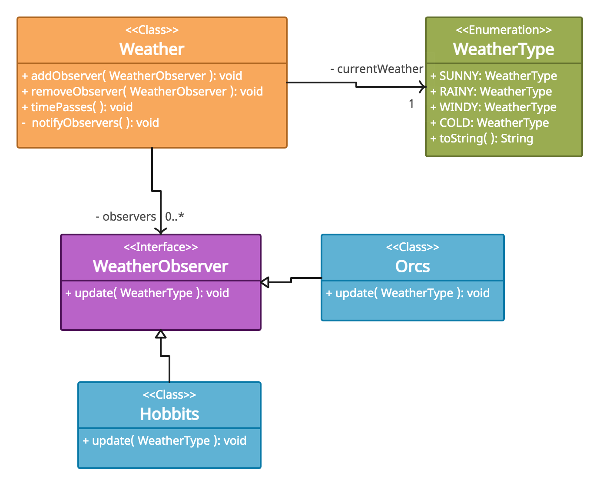

# Design Pattern: Observer

## Definição
* Define uma dependência de um-para-muitos entre objetos. Dessa forma, quando um objeto muda de estado, todos os outros objetos que são dependentes dele são notificados e atualizados automaticamente.

## Exemplo

**Exemplo do mundo real**
> Em uma terra longínqua vivem as raças dos Orcs e dos Hobbits. Ambas gostam de viver ao ar livre, por isso prestam muita atenção às mudanças do tempo. Dizem até que eles observarm o tempo constantemente.
**Em resumo**
> Registre-se como um observador para receber mudanças de estado no objeto.
**O Wikipedia diz**
> O padrão Observer é um design pattern de software na qual um objeto, chamado de sujeito, mantém uma lista de dependentes, chamados observadores, e os notifica automaticamente em caso de qualquer mudança de estado, geralmente invocando um de seus métodos.
**Implementação**

Primeiro, vamos analisar o `WeatherObserver` e as nossas raças, `Orcs` e `Hobbits`.

```java
public interface WeatherObserver {
  void update(WeatherType currentWeather);
}
public class Orcs implements WeatherObserver {
  @Override
  public void update(WeatherType currentWeather) {
    System.out.println("The orcs are facing " + currentWeather.getDescription() + " weather now");
  }
}
public class Hobbits implements WeatherObserver {
  @Override
  public void update(WeatherType currentWeather) {
    switch (currentWeather) {
      System.out.println("The hobbits are facing " + currentWeather.getDescription() + " weather now");
    }
  }
}
```

Temos também o `Weather` que está mudando constantemente.

```java
public class Weather {
  private WeatherType currentWeather;
  private final List<WeatherObserver> observers;
  public Weather() {
    observers = new ArrayList<>();
    currentWeather = WeatherType.SUNNY;
  }
  public void addObserver(WeatherObserver obs) {
    observers.add(obs);
  }
  public void removeObserver(WeatherObserver obs) {
    observers.remove(obs);
  }
  /**
   * Makes time pass for weather.
   */
  public void timePasses() {
    var enumValues = WeatherType.values();
    currentWeather = enumValues[(currentWeather.ordinal() + 1) % enumValues.length];
    System.out.println("The weather changed to " + currentWeather);
    notifyObservers();
  }
  private void notifyObservers() {
    for (var obs : observers) {
      obs.update(currentWeather);
    }
  }
}
```

Aqui está a implementação completa do exemplo

```java
    var weather = new Weather();
    weather.addObserver(new Orcs());
    weather.addObserver(new Hobbits());
    weather.timePasses();
    weather.timePasses();
    weather.timePasses();
    weather.timePasses();
```

Saída do programa:

```
The weather changed to rainy.
The orcs are facing rainy weather now
The hobbits are facing rainy weather now
The weather changed to windy.
The orcs are facing windy weather now
The hobbits are facing windy weather now
The weather changed to cold.
The orcs are facing cold weather now
The hobbits are facing cold weather now
The weather changed to sunny.
The orcs are facing sunny weather now
The hobbits are facing sunny weather now
```

## Diagrama de classes



## Aplicação

Use o padrão Observer nas seguintes situações:

* Quando a abstração tem dois aspectos, um dependente do outro. Encapsulando esses aspectos em objetos separados permite diversificá-los e reutilizá-los separadamente.
* Quando a mudança de um objeto requer mudança em outros, e você não sabe quantos objetos precisam ser mudados.
* Quando um objeto deve ser capaz de notificar outros objetos sem precisar saber quem esses objetos são. Em outras palavras, você não quer esses objetos muito acoplados.

## Referência

* [Observer iluwatar](https://github.com/iluwatar/java-design-patterns/tree/master/observer)
